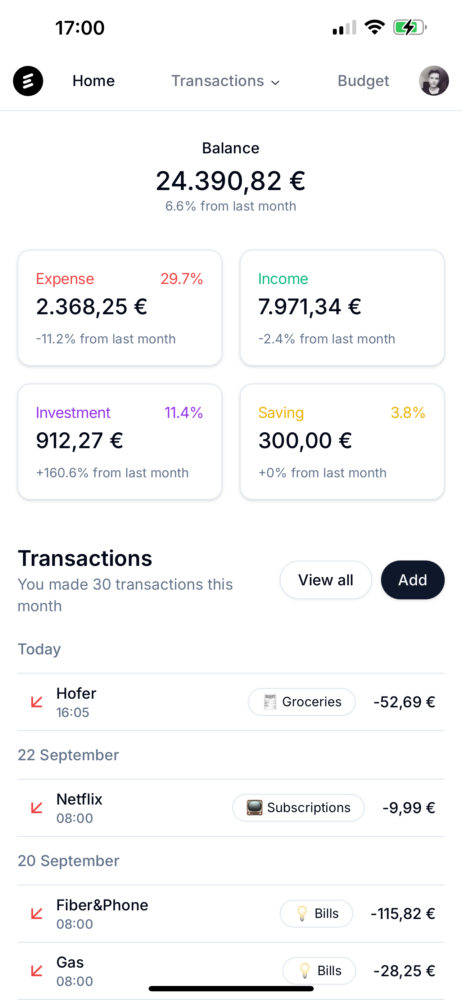

# Expenses

Expenses is an expense tracker application built with Next.js 14. It provides an easy way to track and manage your expenses.

|  |  |  |
| -------------------------------------------------------------------------------------------- | -------------------------------------------------------------------------------------------- | -------------------------------------------------------------------------------------------- |
|  |  |  |

## Technologies

- **Next.js:** React framework for SSR and client-side navigation.
- **TypeScript:** JavaScript superset with static typing.
- **Clerk:** Authentication platform.
- **Neon:** Serverless PostgreSQL database.
- **Drizzle ORM:** Headless TypeScript ORM.
- **Tailwind CSS:** Utility-first CSS framework.
- **React Hook Form:** Form management for React.
- **Zod:** TypeScript-first schema validation.
- **Sonner:** Notification library.
- **Shadcn/ui:** Accessible UI components.
- **Next-pwa:** Progressive Web App.

## Getting Started

Follow these instructions to get up and running on your local machine.

### Prerequisites

- Clerk account
- Neon account

### Installation

1. Clone the repository:

   ```bash
   git clone https://github.com/skuljanze95/expenses.git
   cd expenses
   ```

2. Install dependencies:

   ```bash
   npm install
   ```

3. Create an `.env.local` file with this content:

   ```env
   NEXT_PUBLIC_APP_URL="http://localhost:3000"
   AUTH_GITHUB_ID="<your_github_id>"
   AUTH_GITHUB_SECRET="<your_github_secret>"
   DATABASE_URL="<your_database_url>"
   NEXT_PUBLIC_CLERK_PUBLISHABLE_KEY="<your_clerk_publishable_key>"
   CLERK_SECRET_KEY="<your_clerk_secret_key>"
   NEXT_PUBLIC_CLERK_SIGN_IN_URL="/auth/sign-in"
   NEXT_PUBLIC_CLERK_SIGN_UP_URL="/auth/sign-up"
   NEXT_PUBLIC_CLERK_SIGN_UP_FORCE_REDIRECT_URL="/onboarding"
   NEXT_PUBLIC_CLERK_USER_PROFILE_URL="<your_clerk_user_profile_url>"
   CRON_SECRET="<your_cron_secret>"
   ```

4. Run database migrations:

   You can directly push migrations with Drizzle Kit:

   ```bash
   npm run db:push
   ```

   Or you can generate them with:

   ```bash
   npm run db:generate
   ```

   And then run the migrations with:

   ```bash
   npm run db:migrate
   ```

   You can also add the `npm run db:migrate` script to the build step.

5. Start the development server:

   ```bash
   npm run dev
   ```

6. Open your web browser and access the application at [http://localhost:3000](http://localhost:3000)

## Progressive Web App (PWA)

Expenses is also a Progressive Web App (PWA), which means you can install it on your device. The PWA configuration is handled using the `@ducanh2912/next-pwa` package. The PWA settings are defined in the `next.config.mjs` and `public/manifest.json` files.

## Cron Jobs

This application uses cron jobs to automate certain tasks, such as generating account history and processing recurring transactions. These cron jobs are defined in the `vercel.json` file and will only work if you host the application on Vercel.

## License

Distributed under the MIT License. See `LICENSE.txt` for more information.
